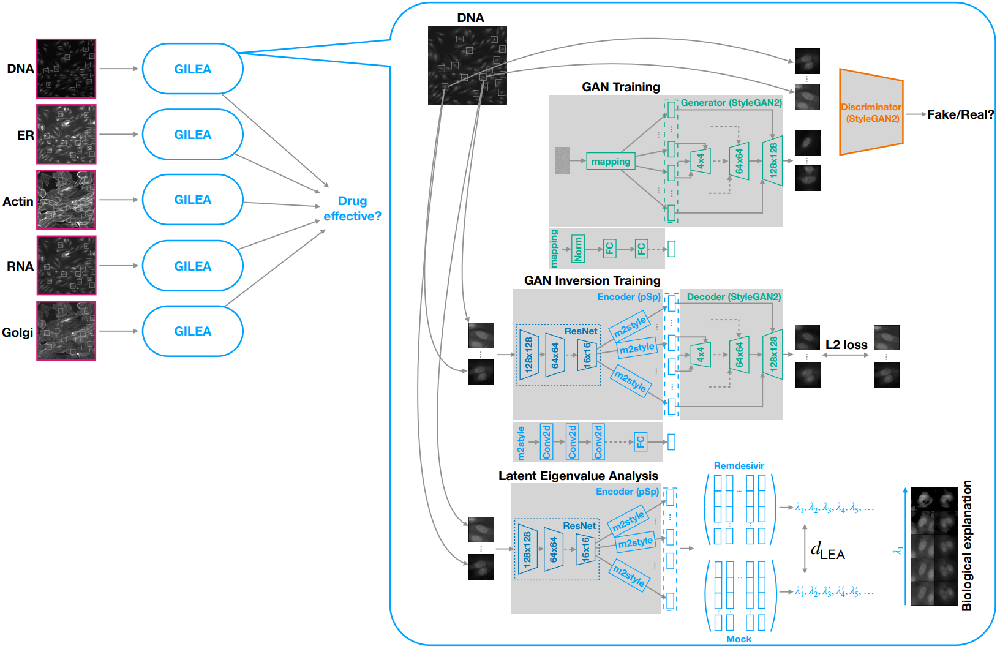

# Code Repostiory
Official PyTorch implementation for the following manuscript:


[LEA: Latent Eigenvalue Analysis in application to high-throughput phenotypic profiling](https://www.biorxiv.org/content/10.1101/2023.02.10.528026v1.full.pdf), Biorxiv 2023. \
Jiqing Wu and Viktor H. Koelzer.

> Understanding the phenotypic characteristics of cells in culture and detecting perturbations introduced by drug stimulation is of great importance for biomedical research. However, a thorough and comprehensive analysis of phenotypic heterogeneity is challenged by the complex nature of cell-level data. Here, we propose a novel Latent Eigenvalue Analysis (LEA) framework and apply it to high-throughput phenotypic profiling with single-cell and single-organelle granularity. Using the publicly available SARS-CoV-2 datasets stained with the multiplexed fluorescent cell-painting protocol, we demonstrate the power of the LEA approach in the investigation of phenotypic changes induced by more than 1800 drug compounds. As a result, LEA achieves a robust quantification of phenotypic changes introduced by drug treatment. Moreover, this quantification can be biologically supported by simulating clearly observable phenotypic transitions in a broad spectrum of use cases. Lastly, we describe the LEA pipeline in detail and illustrate the application to further use cases in the biomedical image domain, underlining the domain-agnostic facet of our methodological approach. In conclusion, LEA represents a new and broadly applicable approach for quantitative and interpretable analysis of biomedical image data. 


<p align="center">
  
<br>
The overall model illustration of the proposed LEA approach.        
</p>


## Demo 


https://user-images.githubusercontent.com/12932355/208067431-02476dc6-16e3-45b0-b9cc-9dce4d46a06f.mp4

<p align="center"> The cellular transition of mock cells for VERO dataset </p>

https://user-images.githubusercontent.com/12932355/208067495-02761dd8-8f32-4de1-926d-90149a6d8b5a.mp4

<p align="center"> The cellular transition of mock cells for HRCE dataset </p>

https://user-images.githubusercontent.com/12932355/208067553-bc6f0f29-b4e8-4c85-8a14-c347f5fc109e.mp4

<p align="center"> The cellular transition of healthy cells for HUVEC dataset </p>

https://user-images.githubusercontent.com/12932355/208067600-e43ecbe3-41be-4784-bf0b-6bdd0951ae3c.mp4

<p align="center"> The skin lesion transition of nv samples for HAM10000  dateset </p>

## Prerequisites
This implementation is mainly dependent on two backends:  [Restyle](https://github.com/yuval-alaluf/restyle-encoder) and [WILDS](https://github.com/p-lambda/wilds). This suggests that, if the dependencies for Restyle and Wilds are installed, then the environment of our code is correctly configured.

Alternatively, to create the conda environment for this repo please see [LEA.yml](LEA.yml),
where all the necessary packages required by this repo are included in the list.

## Data Preparation
To run the experiments investigated in the paper,

1. Download RxRx19a (or b) to a local folder via the following links

    Metadata: https://storage.googleapis.com/rxrx/RxRx19a/RxRx19a-metadata.zip

    Imagedata: https://storage.googleapis.com/rxrx/RxRx19a/RxRx19a-images.zip

2. Download HAM10000 to a local folder via the following link
    
    https://dataverse.harvard.edu/dataset.xhtml?persistentId=doi:10.7910/DVN/DBW86T

Take HAM10000 and HRCE as examples, then we preprocess the datasets by running 
```
    python Dataset/prep_ham10k.py --root /path/to/HAM10000
    python Dataset/prep_rxrx19.py --root /path/to/RxRx19 --rxrx_name rxrx19a --rxrx_cell HRCE
```

Next we convert the processed data to the StyleGAN2/3 required formats by running
```
    python Dataset/prep_style2.py   /path/to/processed_HRCE --out /path/to/style2_HRCE --size 128
    python Dataset/prep_style3.py  --source=/path/to/processed_HRCE --dest=/path/to/style3_HRCE_128x128.zip --resolution=128x128
```

## Pre-training StyleGAN2 and StyleGAN3
Here we pre-train the StyleGAN2/3 with two widely-used repositories:

    1. https://github.com/rosinality/stylegan2-pytorch.git
    2. https://github.com/NVlabs/stylegan3.git

With changing the implementations w.r.t. the image channels, we make the codes compatible for both HAM10000 and RxRx19, please see the implementations of [StyleGAN2](style2/models/stylegan2/model.py) and [StyleGAN3](style3/models/stylegan3/model.py) for more details and modify the related files in both above repos accordingly. 

Assume now the current work directory is ../stylegan2-pytorch/, then run the following commands to train StyleGAN2:

```
    python -m torch.distributed.launch --nproc_per_node=1 --master_port=012 train.py \
        --batch 8 --iter 800000 --size 128  --check_save /path/to/HRCE_style2_decoder  /path/to/style2_HRCE

    python -m torch.distributed.launch --nproc_per_node=1 --master_port=345 train.py \
        --batch 8 --iter 100000 --size 128  --check_save /path/to/HAM10000_style2_decoder /path/to/style2_HAM10000
```

Assume now the current work directory is ../stylegan3/, then run the following commands to train StyleGAN3:

```
    python train.py --outdir=/path/to/HRCE_style3_decoder --cfg=stylegan3-t --data=/path/to/style3_HRCE_128x128.zip --gpus=1 --batch=32 --gamma=0.5 --kimg=5000

    python train.py --outdir=/path/to/HAM10000_style3_decoder --cfg=stylegan3-t --data=/path/to/the/style3_HAM10000_128x128.zip --gpus=1 --batch=32 --gamma=0.5 --kimg=800
```

## GAN inversion
After obtaining robust encoders (StyleGAN2/3 generators), we run the GAN inversion (autoencoder) with the following repositories

    1. https://github.com/yuval-alaluf/restyle-encoder.git
    2. https://github.com/yuval-alaluf/stylegan3-editing.git

With integrating the above changes ([StyleGAN2](style2/models/stylegan2/model.py) and [StyleGAN3](style3/models/stylegan3/model.py)) w.r.t. image channels to the two repos resp.,
we lauch the GAN inversion training. 


Assume the current work directory is ../restyle-encoder/, we run the following commands to train the StyleGAN2_pSp
```
    python scripts/train_restyle_psp.py \
        --dataset_type=ham10k \
        --encoder_type=ResNetBackboneEncoder \
        --exp_dir=/path/to/HAM10000_style2_recon/ \
        --max_steps=100000 \
        --workers=8 \
        --batch_size=8 \
        --test_batch_size=8 \
        --test_workers=8 \
        --val_interval=5000 \
        --save_interval=10000 \
        --start_from_latent_avg \
        --lpips_lambda=0 \
        --l2_lambda=10 \
        --moco_lambda=0.5 \
        --w_norm_lambda=0 \
        --input_nc=6 \
        --n_iters_per_batch=1 \
        --output_size=128 \
        --train_decoder=False \
        --stylegan_weights=/path/to/HAM10000_style2_decoder/100000.pt
    
    # Train the DNA channel
    python scripts/train_restyle_psp.py \
        --dataset_type=rxrx19a_VERO \
        --encoder_type=ResNetBackboneEncoder \
        --exp_dir=/path/to/VERO1_style2_recon/ \
        --max_steps=800000 \
        --workers=8 \
        --batch_size=8 \
        --test_batch_size=8 \
        --test_workers=8 \
        --val_interval=5000 \
        --save_interval=10000 \
        --image_interval=10000 \
        --start_from_latent_avg \
        --lpips_lambda=0 \
        --l2_lambda=50 \
        --moco_lambda=0.5 \
        --w_norm_lambda=0 \
        --input_nc=2 \
        --input_ch=1 \
        --n_iters_per_batch=1 \
        --output_size=128 \
        --train_decoder=False \
        --stylegan_weights=/path/to/VERO_style2_decoder/790000.pt
```


## Latent Eigenvalue Analysis 
With the above reconstruction models in hand, we run the LEA baseline as follows:
``` 
    # Compute the necessary stats
    python -m main \
        --seed=0 \
        --task=stat \
        --decoder=style2 \
        --encoder=psp \
        --data_name=rxrx19a \
        --data_cell=VERO \
        --data_splt=strat \
        --n_eval=8 \
        --n_iter=800000 \
        --data_path=/path/to/RxRx19/ \
        --ckpt_path=/path/to/ckpt/ \
        --save_path=/path/to/save/ \
        --stat_dec --stat_res --stat_eig=scm --stat_top=10

    # Output the baseline plot
    python -m main \
        --seed=0 \
        --task=baseline \
        --decoder=style2 \
        --encoder=psp \
        --data_name=rxrx19a \
        --data_cell=VERO \
        --data_splt=strat \
        --n_eval=8 \
        --n_iter=800000 \
        --data_path=/path/to/RxRx19 \
        --ckpt_path=/path/to/ckpt/ \
        --save_path=/path/to/save/ \
        --stat_dec --stat_res --stat_eig=scm --stat_top=10
```


## Acknowledgment
This repository is built upon [Restyle-encoder](https://https://github.com/yuval-alaluf/restyle-encoder) and [StyleGAN3-editing](https://github.com/yuval-alaluf/stylegan3-editing.git) projects. We would like to thank all the authors contributing to those projects.
We would also like to thank all the authors contributing to the HAM10000 and RxRx19 projects.

## License
The copyright license of this repository is specified with the LICENSE-LEA.

The copyright license of HAM10000 is specified with the License-CC-BY-NC-SA 4.0.

The copyright license of RxRx19 is specified with the License-CC-BY.
